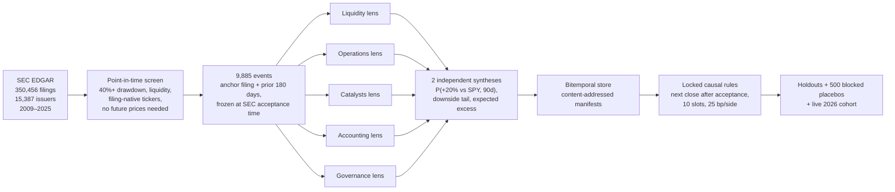
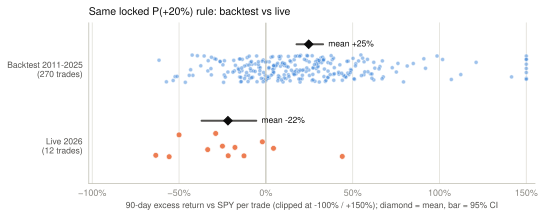
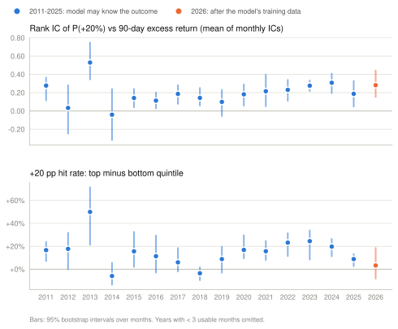
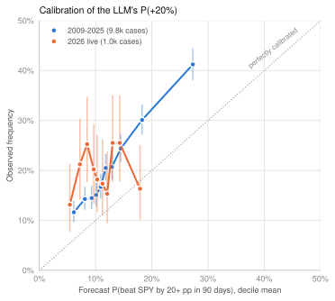
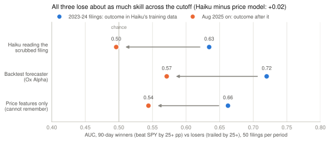

# alphaHunt

**Can an LLM read SEC filings well enough to forecast which beaten-down stocks will
beat the market, and how would you know if it couldn't?**

alphaHunt is a forecasting pipeline and an evaluation harness. Specialist LLM
agents read a company's filings from primary sources. A synthesis step then turns
their findings into a probability: *P(stock beats SPY by 20+ points over the next
90 days)*. Most of the engineering went into the harness. It enforces point-in-time
data, pre-registered rules, placebo tests, and a live forward cohort, because an
LLM backtest is easy to fool.

The backtest was spectacular, and **the live test failed**. The rest of this README
covers what survived out of sample, what didn't, and why.

**Interactive case study:** [david3748.github.io/alphaHunt](https://david3748.github.io/alphaHunt/)
(built from this repo's results by [`docs/case-study/build.py`](docs/case-study/build.py)).


## TL;DR

| | Backtest 2009–2025 | Live 2026 (after the model's training data) |
| --- | --- | --- |
| Cases forecast | 9,807 | 985 |
| Rank IC of P(+20%) vs 90-day excess return | 0.15–0.24 by holdout | **0.28** [0.15, 0.44] |
| AUC for the +20 pp event | 0.61–0.63 | **0.51** (chance) |
| Locked P(+20%) rule, per trade | +24.7% mean excess, 70% win (270 trades) | **−21.9%**, 17% win (12 trades) |
| Locked rule, portfolio | 710× vs SPY 10×; information ratio 1.4; blocked-placebo p = 0.002 | worse than any 12-trade stretch in the backtest |

- **The ranking signal is real and survives out of sample.** It beats seven
  mechanical price features in walk-forward tests (monthly IC 0.30 vs 0.13), and
  its rank correlation *held* in 2026. A pre-registered blind re-score with names
  and tickers scrubbed did not weaken it.
- **The part that made money did not survive.** The backtest's returns came from
  the extreme top of the ranking. In 2026 that tail edge vanished, and the locked
  rule lost 22% vs SPY per trade.
- **The model could often tell which company it was reading, and what came next.**
  91% of the "anonymized" evidence packs still carried a direct identifier. With
  every name word stripped, Claude Haiku 4.5 still named 50 of 80 (62.5%) 2011–24
  companies from 10,000 characters of MD&A. Given only a company's name and filing
  date, Haiku's guesses separated historical winners from losers (AUC 0.65,
  p = 0.007) but not 2026 ones (0.56).
  Its explanations cited events that happened after the filing, such as "COVID-19"
  for a February 2020 10-K. Leakage through the model's own weights can't be ruled
  out for any year before its training cutoff.
- **But memory doesn't explain the collapse on its own.** In a controlled
  before/after test, Haiku reading scrubbed filings lost skill across its training
  cutoff (AUC 0.63 → 0.50). On the same cases, a price-only model that can't
  remember anything lost just as much (0.66 → 0.54), so the difference-in-differences
  is +0.02 [−0.27, +0.32]. Without that control, the naive comparison would have
  looked like proof of memorization. The later period was simply harder.
- **The audit also caught a data bug.** A file-name fallback in the ticker resolver
  priced 4.1% of cases on another company's stock: 166 filings from unrelated small
  companies were priced as Ford. It touched 1 of the 270 backtest trades (a
  subsidiary priced on its parent) and none of the live trades, and removing the
  affected cases raises the historical IC.
- **The probabilities are poorly calibrated.** Forecasts average 11–13%, while the
  event happens 19–21% of the time. Brier skill over a base-rate forecast is about
  +0.02, and walk-forward Platt scaling only brings it to about +0.05.

Full numbers: [`results/forecast_audit/report.md`](results/forecast_audit/report.md).

## The forecasting setup



- **Population.** A case is every 10-K, 10-Q, 20-F, or 40-F filed while the stock
  sat 40%+ below its one-year high, with liquidity filters known at the time. At
  most one event per issuer per 180 days. Tickers come from the filing's own XBRL,
  not today's ticker map (its dei:TradingSymbol, or failing that its file name; see
  [Known issues](#known-issues)). Delisted names stay in and are marked to zero at
  the first gap (conservative bound).
- **Agents.** Five specialist lenses extract exact-quote-grounded claims. Claims
  whose quote isn't in the filing are rejected (about two-thirds survive). Two
  independent syntheses then produce the probabilities. The model was a stealth
  model served through OpenRouter as "Ox Alpha"; its identity and training cutoff
  are undisclosed. About 125,000 LLM calls in total.
- **Trading rule.** Buy when a new score reaches the 90th percentile of *strictly
  earlier* scores (after a 50-case warmup). Enter at the first close after SEC
  acceptance and hold 90 days, with ten 10%-NAV slots, 25 bp per side, T-bills on
  idle cash, and an exposure-matched SPY benchmark.

## Guardrails against fooling yourself

| Failure mode | Guardrail | Where |
| --- | --- | --- |
| Look-ahead in inputs | Bitemporal store (effective / available / system time). Every forecast references a content-addressed manifest that rejects any document available after the knowledge time. Exact SEC acceptance timestamps, not filing dates. | [`temporal_store.py`](src/temporal_store.py), [`sec_enrich.py`](src/sec_enrich.py) |
| Survivorship bias | Filing-native historical tickers; no future price needed for eligibility; delistings bounded conservatively and optimistically | [`sealed_safety.py`](src/sealed_safety.py), [`protocols/sealed_safety.md`](protocols/sealed_safety.md) |
| Garden of forking paths | Rules, cohorts, and pass/fail gates frozen in writing before outcomes were opened; exploratory findings labeled as such | [`protocols/`](protocols/) |
| Luck and regime clustering | 500 placebos shuffling scores within calendar-month blocks; separate 2009–18 and 2021–25 holdouts; 2019–20 kept as discovery only | [`century_hypotheses.py`](src/century_hypotheses.py), [`sealed_safety_eval.py`](src/sealed_safety_eval.py) |
| "An LLM is an expensive momentum screen" | Mechanical baselines (drawdown, momentum, volatility, size) as first-class comparators, walk-forward | [`llm_incremental_value.py`](src/llm_incremental_value.py) |
| The model already knows the answer | Blind re-score, redaction audit, identification and recall probes, a before/after-cutoff test with a mechanical control, live post-cutoff cohort | [`blind_rescore.py`](src/blind_rescore.py), [`redaction_audit.py`](src/redaction_audit.py), [`identification_probe.py`](src/identification_probe.py), [`recall_probe.py`](src/recall_probe.py), [`cutoff_probe.py`](src/cutoff_probe.py) |
| Hallucinated evidence | Exact-quote grounding against the source filing; ungrounded claims are kept for audit but excluded from forecast inputs | [`comprehensive_lab.py`](src/comprehensive_lab.py) |
| Pricing the wrong security | Every case's ticker checked against the CIK that reports it as its own dei:TradingSymbol; flagged cases dropped as a sensitivity check | [`ticker_audit.py`](src/ticker_audit.py) |

## Results

### 1. The backtest (pre-registered secondary rules)

These rules were frozen in [`protocols/century_hypotheses.md`](protocols/century_hypotheses.md)
before any century outcomes were opened.

| Rule | 2009–18 IR | 2021–25 IR | Full-period IR | Blocked-placebo p | Gate |
| --- | ---: | ---: | ---: | ---: | --- |
| `p_plus20`: mean P(+20%) | 1.07 | 1.89 | 1.39 | 0.002 | pass |
| `causal_blend`: z-scored blend of four outputs | 0.97 | 1.97 | 1.32 | 0.002 | pass |
| `upside_x_drawdown` | 1.18 | 1.22 | 1.31 | 0.002 | pass |
| `deep_drawdown` (mechanical comparator) | 0.22 | −0.38 | −0.04 | 0.112 | — |

The LLM adds value over price features in walk-forward tests (ridge model, trained
on earlier years only). Monthly IC was 0.13 for mechanical features alone, 0.30 for
LLM outputs, and 0.29 combined, for 2021–2025. The causal top-decile portfolio IR
was −0.13 mechanical, 0.59 LLM-only, and 0.94 combined.

### 2. The live test

The same locked rules ran on every eligible 2026 filing (996 cases, scored on
2026-08-24) and were graded once each 90-day window closed.

<picture>
  <source media="(prefers-color-scheme: dark)" srcset="docs/figures/backtest_vs_live-dark.svg">
  
</picture>

Twelve trades is a small sample. Still, the backtest's worst run of 12 consecutive
trades averaged −16.9% (Q4 2018), and the live run averaged −21.9%. The two other
locked rules also lost live: `upside_x_drawdown` −13.4% over 34 trades, and the
blend −2.0% over 28.

### 3. What survived and what didn't

<picture>
  <source media="(prefers-color-scheme: dark)" srcset="docs/figures/signal_by_year-dark.svg">
  
</picture>

The cross-sectional rank correlation is as strong in 2026 as in any recent year.
The LLM is reading something real in filings. What collapsed is its ability to
single out the stocks that jump 20+ points. That was the only part of the ranking
the trading rule used.

### 4. Calibration

<picture>
  <source media="(prefers-color-scheme: dark)" srcset="docs/figures/calibration-dark.svg">
  
</picture>

The model is a timid forecaster: every decile sits above the diagonal. Rescaling
helps historically, with walk-forward Platt Brier skill rising from +0.02 to
+0.05. In 2026 the curve goes flat and skill turns negative (−0.06 raw, −0.02
recalibrated). The ordering is somewhat informative, but the probabilities can't
be taken at face value.

### 5. Could the model tell which company it was reading?

| Test | Result |
| --- | --- |
| Pre-registered blind re-score ([protocol](protocols/blind_rescore.md)): 110 cases re-run with names, tickers, EINs, and file numbers scrubbed | Signal unchanged (Spearman 0.39 → 0.39, AUC 0.70 → 0.71). Verdict *GENUINE* for the name/ticker channel. |
| Redaction audit of all 10,875 evidence packs ([`redaction_audit.py`](src/redaction_audit.py)) | 91% still contain a direct identifier. The distinctive name word survives in 61% of packs that have one (for example, "Nabors" 126 times after "NABORS INDUSTRIES LTD" was redacted). The cover-page address survives in 85%. |
| Identification probe ([`identification_probe.py`](src/identification_probe.py), [answers](results/identification_probe/table.md)): 100 Haiku agents, one case each in a fresh context, given 10,000 characters of MD&A with every name word, ticker, URL, and tax ID stripped. Same 100 cases as the recall probe. | Named **50 of 80** 2011–24 companies (62.5%, 95% CI 52–72%; 66% within its top 3), and 10 of 20 from 2026. The giveaways were products, drugs, subsidiaries, mines, and former names: "NVX-CoV2373" (Novavax), "nusinersen … Akcea" (Ionis, named as its old name Isis), "Palmarejo, Kensington, Rochester" (Coeur). Its confidence ranked right vs wrong answers almost perfectly (AUC 0.95). Many misses had the right clues but the wrong name, so this is a floor. An earlier 48-case batch got 53% from 4,500 characters. |
| Named-recall probe ([`recall_probe.py`](src/recall_probe.py), [answers](results/recall_probe/table.md)): 100 Haiku agents, one case each in a fresh context, given only company, ticker, and filing date. 80 extreme 2011–2024 moves, 20 in 2026. | 2011–24: P(outperform) AUC **0.65** [0.54, 0.75], permutation p = 0.007; 0.72 for large, liquid names vs 0.58 for small. 2026 controls: 0.56 [0.31, 0.80]. On the same cases the filing-reading forecaster scored 0.69 historically vs 0.54 in 2026. Haiku's name-only guesses correlated 0.34 with its forecasts historically, and −0.02 in 2026. |

The blind test rules out leakage through explicit identifiers. It cannot rule out
recognition through business descriptions or addresses, and the identification
probe shows that channel is wide open even for a small model reading a fraction of
the evidence the forecaster saw.

The recall probe exposes a second channel that no redaction can close: the date.
Haiku never claimed to remember a specific 90-day move. But its notes describe
what the market did after the filing:

- "Silver prices collapsed in spring 2013" (Coeur d'Alene Mines, filed 2013-02-21, −39%)
- "heavily impacted by COVID-19" (Kosmos Energy, filed 2020-02-25, −44%)
- "Late 2020 saw oil price recovery with vaccine optimism" (Baker Hughes, filed
  2020-10-23, +48%)

A filing's date and industry are enough to recall the regime that followed. So a
backtest of an LLM forecaster on data from before its training cutoff can't be taken
at face value. How much it overstates skill is a separate question.

### 6. Memory or market? A before/after-cutoff test

<picture>
  <source media="(prefers-color-scheme: dark)" srcset="docs/figures/cutoff_probe-dark.svg">
  
</picture>

[`cutoff_probe.py`](src/cutoff_probe.py) ([answers](results/cutoff_probe/table.md))
keeps the model, prompt, and evidence fixed and changes only whether the outcome is
in the model's training data. 100 fresh Haiku contexts each forecast one filing from
10,000 characters of name-scrubbed MD&A, under the backtest forecaster's own
instruction to use nothing but the excerpt:

- 50 filings from January 2023 to September 2024, whose 90-day outcomes are in
  Haiku's training data;
- 50 filings from August 2025 on, whose outcomes come after it.

Each period has 25 stocks that beat SPY by 25+ points and 25 that trailed by 25+.

Haiku's AUC fell from 0.63 to 0.50, which on its own looks like memorization. But
on the same cases the backtest forecaster fell by as much (0.72 → 0.57), and so did
a walk-forward model on price features alone (0.66 → 0.54), which cannot know the
future. The difference-in-differences against that model is +0.02 [−0.27, +0.32].
No rationale named its company or cited a later event.

With 50 filings per period, the test rules out only a large memorization effect.
It does show that the period after the cutoff was harder for every scorer. So the
live collapse is at least partly the market, and a before/after comparison means
little without a control that can't remember anything.

## Next steps

1. **Evaluate only after the cutoff.** Use models with published training
   cutoffs, score only filings after that date, and keep a rolling live cohort.
   Treat everything earlier as development data. Redaction can't fix the date
   channel.
2. **Make re-identification a gate.** Before a case enters a backtest, an
   adversarial "name this company" model must fail on the evidence pack.
   Neutralize addresses, segment names, and product names, not just the
   registrant name.
3. **Separate leakage from regime at scale.** Seven of the 12 live losers came in
   February–March 2026, several of them software stocks. The before/after test
   above is the right design, but at 50 filings per period its interval is ±0.3
   AUC. Run it with the production forecaster on about 1,000 filings, with
   sector-neutral scoring and more live months.
4. **Forecast the whole distribution, not just the tail.** The signal lives in
   the middle of the ranking. A long/short or quintile-spread construction uses
   it. A top-decile long-only rule depends on the tail.
5. **Add a calibration layer and a second model family.** Walk-forward
   recalibration, plus ensembles across model families (the TypeSafe/Jev rerun in
   [`protocols/century_typesafe.md`](protocols/century_typesafe.md) is
   pre-registered and paused at 100 of about 49k judgments).

## Known issues

- **Some cases were priced on another company's stock.** When a filing has no
  dei:TradingSymbol, the resolver falls back to the XBRL file name (`gogo-20251231.xml`
  → GOGO). That's usually the issuer's own ticker, but not for shells, non-traded
  funds, and subsidiaries. The identification probe first surfaced it: 23 AR
  Capital-family REITs from 2014–16 inherited ARCT (Arcturus Therapeutics today),
  and eleven of them show the same +66% outcome on one date.
  [`ticker_audit.py`](src/ticker_audit.py) ([report](results/ticker_audit/report.md))
  then checked every case against the CIK that reports each ticker as its own:

  - 446 of 10,787 cases (4.1%) are flagged, 316 of them probably mis-priced.
  - 166 filings from unrelated small companies were priced as Ford: their filing
    agent names XBRL files like `f10q0919_company_htm.xml`, and the fallback keeps
    only the letters before the first digit. Others include Ridgewood Energy's S, U,
    and W funds (priced as SentinelOne, Unity, and Wayfair) and Go Go Buyers
    (priced as Gogo).
  - Only one of the 270 backtest trades is flagged, and none of the 74 live trades.
    The flagged backtest trade is PBF Holding, a subsidiary priced on its parent.
  - Dropping every flagged case moves the monthly IC from 0.15 to 0.19 (2009–18),
    0.24 to 0.25 (2021–25), and 0.28 to 0.275 (2026).
  - The probes report the same check. The recall AUC stays 0.65, and the cutoff
    test's difference-in-differences goes from +0.02 to +0.03.

  The fix is a CIK-keyed security master that never infers a ticker from a file
  name.

## Repository map

```
src/
  sealed_safety.py, century_pipeline.py   SEC enumeration, point-in-time symbols and prices, case builder
  ox_lab.py, comprehensive_lab.py         evidence packs, redaction, 5-lens extraction, synthesis, grounding
  temporal_store.py, sec_enrich.py        bitemporal DuckDB store, manifests, acceptance-time enrichment
  sealed_safety_eval.py, century_hypotheses.py, safety_backtest.py
                                          causal portfolio simulation, blocked placebos, locked rules
  live_predictions.py, live_outcomes.py   live 2026 cohort: board and grading
  llm_incremental_value.py                LLM vs mechanical features, walk-forward
  forecast_audit.py, redaction_audit.py, identification_probe.py, recall_probe.py,
  cutoff_probe.py, memorization_probe.py, blind_rescore.py
                                          leakage and calibration audits
  ticker_audit.py                         which cases were priced on another company's stock
  pipeline_monitor.py                     read-only HTTP monitor for cloud runs
  ...                                     side experiments (below)
protocols/      frozen pre-registrations, copied verbatim from each run
results/        small committed outputs (audit reports, probe answers)
data/           reference data and the audit input snapshot
docs/           case study (index.html), figures/, notes/ research log, week-one/ first write-up
reports/        standalone HTML research reports
sites/          Next.js/vinext front-ends for the results
cloud/, scripts/  Azure VM, Docker, and supervisor scripts for the century run
tests/          299 offline tests with committed fixtures
```

Run data (about 11 GB of filing packs, LLM outputs, and caches under `lab_runs/`
and `research/`) is not committed.

## Reproduce

```bash
pip install -r requirements.txt
python -m pytest -q                         # 299 offline tests
python src/forecast_audit.py                # rebuilds the audit from data/audit_inputs/
python src/memorization_probe.py            # rescores the re-identification probe
python src/recall_probe.py score --probe-dir results/recall_probe --results results/recall_probe
python src/identification_probe.py score --probe-dir results/identification_probe
python src/cutoff_probe.py score --probe-dir results/cutoff_probe
python src/ticker_audit.py                  # needs the local run data (lab_runs/)
```

The full pipeline needs an OpenRouter key (`OPENROUTER_API_KEY`) and a
[SEC-compliant user agent](https://www.sec.gov/os/accessing-edgar-data). The
century run took about 70k calls on a 4-vCPU VM. See
[`docs/notes/CENTURY_RUNBOOK.md`](docs/notes/CENTURY_RUNBOOK.md).

## Side experiments

The same harness was used to try other unstructured-data ideas. Most failed or
remain exploratory; details are in [`docs/notes/`](docs/notes/) and
[`reports/`](reports/).

- **Avoid-lists:** CPSC and FDA Class I recalls, USITC §337 cases, 8-K executive departures.
- **Event sources:** Form 4 insider buying since 2003, first-time lobbying
  registrations, Exhibit 21 subsidiary resolution.
- **Commodities:** NASA weather and USDA yields for grains and softs, with
  staged, ablation-first backtests.
- **Real estate:** point-in-time REIT property exposure from filings, and
  satellite built-up area (GHSL) as a supply signal.
- **Macro reports:** UK and global short rates (market vs model), shorting
  bonds during capex booms.

---

*Research code, not investment advice. Every result above that was not
pre-registered is labeled exploratory.*
