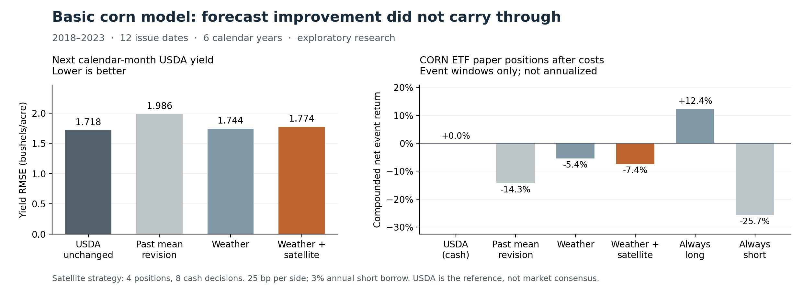

# Basic corn model: usable research pipeline, negative first result

The fixed model forecasts the next calendar-month USDA national corn-yield revision, then translates the forecast into a costed CORN ETF paper position. **This first test did not establish a forecast or trading advantage.** Satellite RMSE was 1.7745 bushels/acre, versus 1.7183 for leaving USDA unchanged and 1.7440 for weather. The satellite rule took 4 positions across 12 issue dates and compounded to -7.37% after costs; weather returned -5.40% and always-long +12.45%. No parameters were tuned to these results.



The figure shows point estimates. The intervals below measure conditional sampling uncertainty; they do not remove the effects of prior research selection or revised source data.

## Run the model

From the repository root:

```sh
python -m src.corn_model backtest
python -m src.corn_model forecast --as-of 2023-09-15
python -m src.corn_model forecast --as-of 2026-09-15
python -m src.corn_model_report
```

The backtest reproduces the frozen historical test offline. The 2023 command returns a historical research card. **The 2026 command must abstain:** county inputs stop at 2023-09-15. Fresh USDA and market prices cannot replace missing current-year satellite/weather observations. No forecast is silently carried forward, no order is submitted, and these commands create no recurring automation.

## What the four forecasts mean

The anchor is the latest same-crop-year USDA WASDE report published before August 15 or September 15 at noon UTC. The target is the first report in the **next calendar month**, not the next arbitrary later report, end-of-season yield, a county yield, or a futures price. A cancelled report stays unlabeled. USDA is a public reference forecast, **not analyst consensus**.

| Model | Definition |
| --- | --- |
| USDA unchanged | Carry forward the latest public national yield estimate; predict a zero revision. |
| Past mean revision | Add the same-horizon average revision from released earlier years. |
| Weather | Calibrate the covered-county weather-minus-trend anomaly plus an issue-month indicator to national revisions. |
| Weather + satellite | Add the covered-county satellite-minus-weather increment to the same weather calibration. |

Both fitted models use training-only standardization and ridge alpha 10 with an unpenalized intercept. Calibration uses strictly earlier harvest years with released target reports, at least 5 distinct years and 8 outcomes. The first five source years warm up the model; 10 early issue rows abstain rather than report fitted predictions. Evaluation is chronological 2018–2023 on 12 matched issue dates across 6 years. August and September observations within a year are related, so they are not twelve independent seasons.

The county inputs previously improved county-yield forecasts. That result does **not** imply that their aggregate will predict a national USDA report revision or a price surprise. The covered-county proxy is calibrated rather than treated as a direct national-yield estimate. In this evaluation, it covers 85.8%–99.8% of reported prior-year area in the eligible county universe, corresponding to 77.1%–95.0% of USDA prior-year national harvested area. Those are different denominators; coverage is not all-US crop coverage.

## Forecast scores

RMSE and MAE use equal calendar-year weighting, in bushels/acre. Lower is better.

| Model | RMSE | MAE |
| --- | --- | --- |
| USDA unchanged | 1.7183 | 1.3250 |
| Past mean revision | 1.9856 | 1.6605 |
| Weather | 1.7440 | 1.4278 |
| Weather + satellite | 1.7745 | 1.4131 |

A positive reduction below favors satellite; a negative number means satellite is worse.

| Compared with | Satellite RMSE reduction | Conditional 95% interval |
| --- | --- | --- |
| USDA unchanged | -3.27% | [-18.15%, +13.42%] |
| Past mean revision | +10.63% | [+1.07%, +21.97%] |
| Weather | -1.75% | [-7.13%, +5.53%] |

Satellite beats the weaker historical-mean-revision control but does not beat unchanged USDA or weather in this sample. The paired uncertainty uses 10,000 circular bootstrap draws of 2-calendar-year blocks, seed 20260927. With only 6 year clusters, these intervals are descriptive and fragile. Earlier research already examined related 2013–2023 inputs and returns; this is not an untouched final holdout and no correction for that research search is claimed.

## Fixed paper-trading rule

A predicted yield more than 0.5 bushels/acre below the latest USDA estimate produces a long paper position; more than that amount above produces a short; otherwise the model holds cash. This is a supply hypothesis relative to USDA, not an estimated return probability or surprise relative to market expectations. Unchanged USDA is always cash by construction, which is why its zero return is not a successful active strategy.

The instrument is **CORN, a multi-maturity corn-futures ETF proxy**. Authentic individual December-contract history was not available from the checked free endpoints; no continuous-contract price series is mislabeled as December corn. Entry is the first New York trading session on a strictly later date than the issue, at the daily close; exit is 20 sessions after entry. Exposure is one initial notional, with 25 bp entry cost, 25 bp exit cost and 3% annualized calendar-day borrow for shorts. Missing required quotes or unfinished windows abstain. The saved event windows do not overlap; no overlapping full-notional returns are compounded.

| Strategy | Events | Positions | Cash | Mean net/event | Compounded event net | Double-cost compound |
| --- | --- | --- | --- | --- | --- | --- |
| USDA unchanged | 12 | 0 | 12 | +0.00% | +0.00% | +0.00% |
| Past mean revision | 12 | 6 | 6 | -1.22% | -14.30% | -16.91% |
| Weather | 12 | 4 | 8 | -0.42% | -5.40% | -7.30% |
| Weather + satellite | 12 | 4 | 8 | -0.59% | -7.37% | -9.24% |
| Always long | 12 | 12 | 0 | +1.09% | +12.45% | +5.94% |
| Always short | 12 | 12 | 0 | -2.33% | -25.68% | -30.13% |

Cash events remain in the event mean and compound path; they are not omitted to inflate average returns. Double cost doubles execution fees only and preserves the borrow rate. These are event-window returns, not annualized performance, a risk-adjusted alpha estimate, or continuous investment returns. Fund expenses and rolling effects are already in ETF prices. Borrow availability, actual bid/ask spreads, taxes and capacity are not independently verified.

| Strategy | 95% interval: mean event return | 95% interval: advantage over weather |
| --- | --- | --- |
| USDA unchanged | [+0.00%, +0.00%] | [+0.00%, +0.98%] |
| Past mean revision | [-2.69%, +0.00%] | [-2.41%, +0.00%] |
| Weather | [-0.98%, +0.00%] | [+0.00%, +0.00%] |
| Weather + satellite | [-1.32%, -0.03%] | [-0.91%, +0.56%] |
| Always long | [-0.09%, +2.62%] | [+0.12%, +3.09%] |
| Always short | [-3.85%, -1.15%] | [-3.85%, -0.45%] |

Market intervals, when present, bootstrap the paired annual means of event returns using the same calendar-year block scheme. They describe **mean event returns**, not confidence bands around compounded returns. No profitable strategy or trading alpha is verified.

## Historical example: 2023-09-15

The latest available USDA estimate was 173.8 bushels/acre. The satellite model projected 174.254 for the 2023-10 report, a +0.454 revision. That difference was below the 0.5 threshold, so the paper signal was **flat**, with no position.

Holding USDA harvested area and all other balance-sheet items fixed, the revision implies +39.6 million bushels of production and ending stocks, and a conditional stocks-to-use ratio of 15.71%. This is a conditional arithmetic scenario, not an independently validated production, demand or stocks forecast. The model preserves the published USDA production rounding and changes it by yield revision times stated harvested area.

## Sources, timing and reproduction

USDA observations preserve the published WASDE vintage and publication time; county features come from current revised archives with a static 2021 crop map. A 2021 map reference year does not establish that it was publicly available in 2021. The weather baseline is a reanalysis-based proxy and is not exclusively ground observations. These source limitations prevent an original-vintage operational backtest claim, even though calibration uses prior labels and issue-time information checks. Market adjusted closes are also a currently retrieved historical snapshot, not verified executable historical adjusted prices.

The frozen specification is in [protocol.json](protocol.json), and the exact numerical configuration is in [../../config/corn_model.json](../../config/corn_model.json). Source snapshots and manifests are under [inputs](inputs); market execution assumptions and provenance are described in [../../docs/notes/corn_market_sources.md](../../docs/notes/corn_market_sources.md). Raw output files are [predictions.csv](predictions.csv), [paper_trades.csv](paper_trades.csv), [historical_example.json](historical_example.json) and [summary.json](summary.json). A vector version of the figure is [corn_model_results.pdf](corn_model_results.pdf).

The renderer only reads saved output files and checks that forecast/trade metrics match their CSV rows. It does not fetch data, refit models or choose parameters. `report_manifest.json` records the input and output hashes for this rendering. Refreshing inputs requires explicitly rebuilding and reviewing dependent results; it cannot make the county data extend beyond their actual last year.
