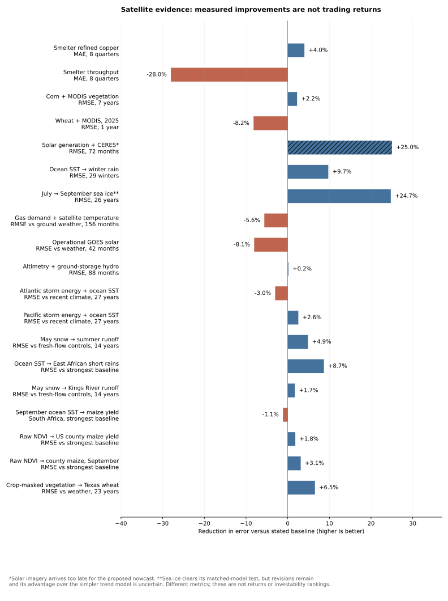

# Satellite alpha: continuation and independent validation

This continues `claude/cool-bohr-oco47t` in `David3748/alphaHunt`. The original
Sentinel-2 construction and smelter experiments are preserved and audited.
MODIS crop vegetation and CERES solar irradiance are implemented as additional
sources, with NOAA satellite-based ocean temperatures evaluated separately.

**No tradable alpha is verified.** Small forecast improvements are distinguished
from robust improvements, and retrospective estimation is distinguished from
data that could actually have been available before the target announcement.
**The requested local verification milestone remains unmet:** none of the five
locally tested mechanisms passes its stated forecast gate. The user accepts
forecast improvement as usefulness; we do not substitute a
physical correlation or an in-sample fit for that requirement.

## Results

| Satellite source and possible information advantage | Independent test | Result | Decision |
|---|---|---|---|
| Sentinel-2 furnace heat: copper supply / producer output surprises | Kennecott quarterly production, 8 chronological predictions during 2024–2025; scene and label publication gates | Refined-copper MAE 12.21 kt versus persistence 12.72, but historical mean 12.09; throughput MAE 49.45 kt versus persistence 38.63 | Not verified; physical outage detection alone is insufficient |
| Sentinel-2 exterior construction: delivery / revenue-recognition risk at data-center operators | Eight campuses, publication-aware warning replay, independently sourced delay and on-time delivery controls | Denton's October 8, 2025 endpoint-only warning disappears when known input publication dates are enforced; APLD still false-alerts before on-time delivery | Not verified |
| MODIS vegetation: crop supply surprises beyond weather and radiation | Prior-year-only training, 2018–2024 evaluation, trend/weather/prior-year-NDVI comparisons; all nine crop-stage cells retained | Corn flowering RMSE 7.142% versus weather 7.306%: 2.24% improvement, uncertainty spans zero. Selected wheat-heading 2025 check is 8.19% worse than weather | Not verified |
| CERES solar irradiance: solar generation / revenue nowcasting | Topaz output reported independently to EIA; 72 monthly test estimates, 2020–2025 | RMSE 10,925 MWh versus 14,567: 25.00% lower. Year-block interval for reduction 14.31%–35.77%; worse in 2022 | Retrospective estimation works, but source latency defeats the proposed historical nowcast |
| NOAA OISST ocean temperatures: seasonal crop / hydropower supply risk | September Niño3.4 → ensuing Texas winter rain; 29 test winters, 1998–2026, initial 15 winters training | RMSE 1.604 inches versus historical mean 1.777: 9.74% lower. Paired two-winter-block gain interval −0.150 to +0.457 inches | Promising point improvement; uncertainty gate fails |



Full inputs, per-observation forecasts, failures, provenance, and uncertainty are
in the neighboring `construction/`, `smelters/`, `third_signal/`, `solar/`, and `enso/`
directories. `summary.json` collects machine-readable decisions;
`input_manifest.json` records hashes. These are exploratory analyses, not a
preregistered discovery or an original-vintage live record.

## Separate market test

The wheat test uses the production-weighted heading-stage forecasts, buys when
predicted supply is below trend and shorts when it is above. The satellite
overlay instead trades the difference between satellite-plus-weather and
weather-only forecasts. Entry is the first Friday strictly after the assumed
feature availability date; the return ending on that Friday is excluded. The
holding period is fixed at 12 weeks. Costs are 25 basis points per entry and exit
plus 5 basis points per scheduled contract roll. The underlying ERS futures
returns follow actual contracts rather than interpreting front-contract roll
price gaps as returns. Collateral cash interest is excluded.

| Strategy | 2018–2024, 7 event years: compounded net return | 2025 diagnostic year |
|---|---:|---:|
| Weather-only forecast | −19.22% | +9.32% |
| Weather plus MODIS forecast | −19.22% | −9.91% |
| Incremental satellite overlay | −0.28% | −9.91% |

These are returns across annual event windows, not annualized returns. The two
full-forecast strategies choose identical directions in all seven original
years. No trading parameter was optimized. The 2025 check is **not untouched**:
aggregate prior research included that year, and an invalid intermediate crop
run had already exposed its outcomes. Small samples, static crop weights,
current-vintage inputs and unmodeled information competition prevent a claim of
market alpha. See `trading/` for each event, exact rules and source hashes.

## Why the timing audit changes the original pilot

Across eight independent campuses, **437 of 837 post-baseline composite rows**
contain at least one known input published after the endpoint timestamp.
Some scenes were republished more than three years after acquisition. The old
CSV recorded the final scene's creation timestamp, not all composite inputs.
The conservative replay identifies known late dependencies; missing constituent
lineage prevents full historical certification even after that guard.

The construction code now excludes future baseline acquisitions and inputs not
published by its decision time, omits missing publication timestamps, and
exports `available_at`, maximum input publication time and input dates. It also
handles empty usable samples. The inherited CSVs remain explicitly historical
pilot artifacts, because changing code cannot repair already aggregated pixels.
Global daily scene selection and hindsight site/AOI selection remain disclosed.

[Core Scientific's October 24, 2025 filing](https://investors.corescientific.com/sec-filings/all-sec-filings/content/0001628280-25-046272/core-20250930.htm)
already discussed construction delays and completed data halls. Thus exterior
area stagnation did not establish stopped construction, and November 10 was not
the first public warning. CoreWeave's later transcript did not name the delayed
provider; assigning it specifically to Denton is retrospective attribution.

## Data checks and limits

- **Smelters:** 13 original Rio production PDFs checked; source URLs, release
  dates, page references and hashes retained with quarterly labels. Missing
  cloudy scenes stay missing. A Codelco closure is physically visible, but its
  refinery continued after the smelter closed—those are different targets.
- **Vegetation:** nine freshly downloaded USDA county GeoTIFFs reproduce cached
  NDVI means to floating-point precision. Weekly composite dates receive an
  explicit 14-day assumed processing lag. Corrected stage mapping excludes later
  crop stages. The invalid intermediate mapping and failed confirmation are
  archived under `third_signal/superseded_stage_order_bug/` and never counted as
  valid evidence. Final annual yields and weather are current-vintage archives.
- **Solar:** EIA's fuel/prime-mover/plant-total duplicates are filtered to one
  solar-PV series. The baseline controls calendar month and time trend; a
  prior-year-irradiance placebo does not match the contemporaneous improvement.
  However, NASA identifies the downloaded source as SYN1DEG, which arrives
  roughly three to four months after observation. Today's historical values
  cannot be backdated to the much faster FLASHFlux release. Historical FLASHFlux
  downloads require Earthdata access, and a first-release archive was not
  recovered. This result does not satisfy an operational forecasting gate.
- **Ocean temperatures:** NOAA explicitly identifies the index as OISST, which
  blends satellite and in-situ measurements. The September-to-winter test gives
  at least 47 days before the target season begins, using an assumed two-week
  product delay. It does not isolate satellites' incremental contribution versus
  in-situ SST, recover historical revisions, or establish an advantage over
  existing public ENSO forecasts. State, season and model were fixed before
  examining this candidate's outcomes.

Primary source documentation:
[USDA MODIS/VegScape](https://www.nass.usda.gov/Research_and_Science/Cropland/metadata/metadata_VegScape.htm),
[NASA POWER source and latency table](https://power.larc.nasa.gov/docs/methodology/data/sources/),
[Copernicus reprocessing history](https://documentation.dataspace.copernicus.eu/Data/Others/Sentinel2_L2A_baseline.html),
[EIA Topaz generation](https://www.eia.gov/electricity/data/browser/#/plant/57695).

## External evidence and the next data hurdle

The original published [JFQA parking-lot study](https://doi.org/10.1017/S0022109023001448)
reports that satellite utilization helps predict same-store sales and a
historical earnings-event trading spread. This is useful evidence for choosing a
future commercial-data pilot, not a local replication. Its sales table does not
report held-out forecast RMSE or a satellite-free ablation, and its return figure
does not subtract every implementation cost. The source data are proprietary.
The table-level audit is in `literature/evidence.json` and
`docs/notes/satellite_external_evidence.md`; it does not change our gate result.

For the best measured local effect—solar—the concrete missing evidence is an
original-release low-latency irradiance archive paired with generation-release
vintages. For crop vegetation, stronger historical coverage and a new unexamined
season are needed after the failed check. Neither buying imagery nor waiting for
future data guarantees an edge. No purchase, trading order, or scheduled task
was created.

## Reproduce from a fresh checkout

```bash
pip install -r requirements.txt
python3 src/satellite_construction_validation.py
python3 src/satellite_smelter_validation.py
python3 src/satellite_crop_validation.py
python3 src/satellite_crop_confirmation.py
python3 src/satellite_crop_trading.py --confirmation results/satellite_validation/third_signal/confirmation_predictions_2025.csv
python3 src/satellite_solar_validation.py
python3 src/satellite_enso_validation.py
python3 src/satellite_validation_report.py
python3 -m pytest -q
```

The validation commands use committed compact inputs and do not need cloud
credentials. Remote source refreshes are explicit options; re-extracting all
original Sentinel pixels is a separate, larger operation. Source-specific
methods are documented under `docs/notes/satellite_*validation.md` and
`docs/notes/satellite_crop_trading.md`. The shared evaluation contract is
`protocols/satellite_validation.md`.
